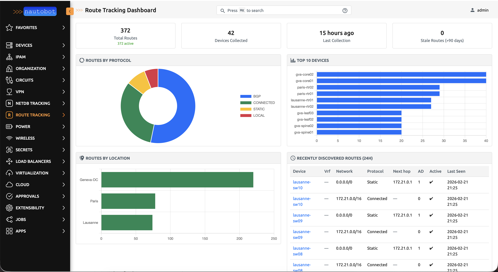
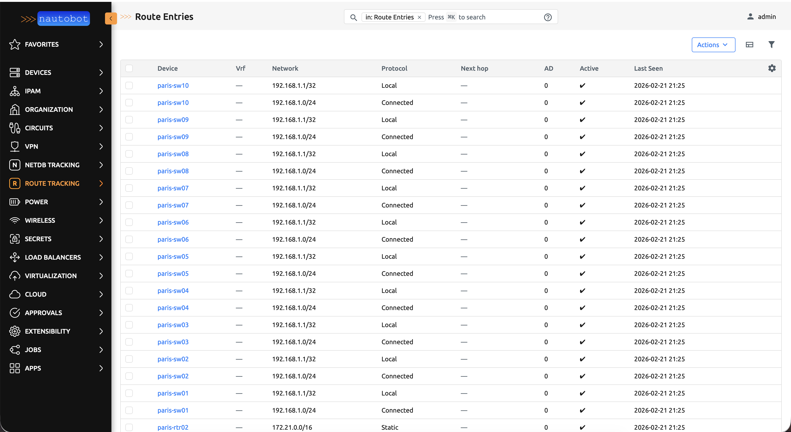
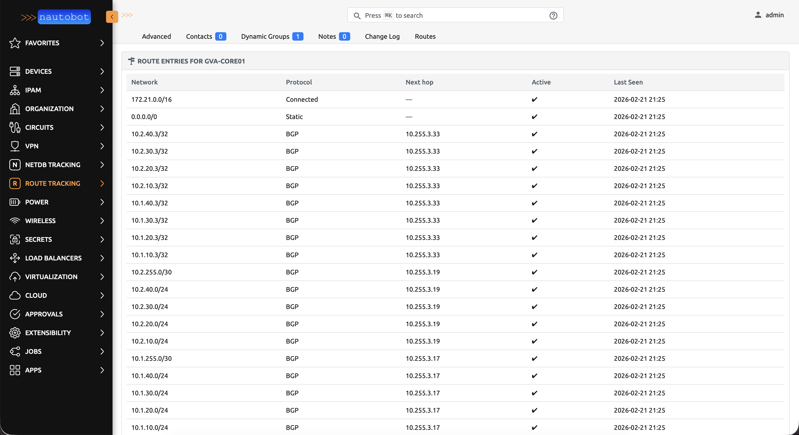
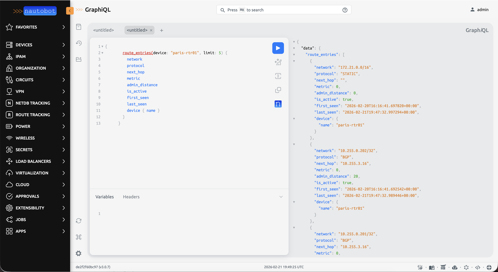

# nautobot-route-tracking

A Nautobot 3.x plugin that collects and historizes routing table entries from network devices via NAPALM CLI commands.

## Screenshots

### Dashboard

Overview page with stats, charts (protocol distribution, top devices, routes by location), and recently discovered routes.



### Route Entries List

Searchable, filterable table of all collected route entries.



### Device Routes Tab

Per-device route table displayed as a tab on the Device detail page.



### GraphQL API

Full GraphQL support with FilterSet integration.



## Features

- **Dashboard**: Standalone overview page with stat panels, Chart.js charts, and recent routes table
- **Historical tracking**: Maintains history of route entries with intelligent UPDATE vs INSERT logic (NetDB pattern)
- **ECMP support**: Each next-hop is stored as a separate `RouteEntry` row
- **Multi-vendor**: Cisco IOS/IOS-XE and Arista EOS via NAPALM CLI
- **Parallel collection**: Nornir-based parallel job for large device fleets
- **Nautobot integration**: Native UI, REST API, GraphQL, Device tab, permissions
- **VRF support**: Collects routes from all VRFs (EOS: `show ip route vrf all`, IOS: `show ip route vrf *`)
- **Retention management**: Configurable purge job for stale route entries

## Requirements

- Nautobot >= 3.0.6
- `nautobot-plugin-nornir`
- `nornir-napalm`

## Installation

```bash
pip install nautobot-route-tracking
```

Add to `nautobot_config.py`:

```python
PLUGINS = ["nautobot_route_tracking", "nautobot_plugin_nornir"]

PLUGINS_CONFIG = {
    "nautobot_route_tracking": {
        "retention_days": 90,
    },
    "nautobot_plugin_nornir": {
        "use_config_context": {"connection_options": True},
    },
}
```

Run migrations:

```bash
nautobot-server migrate
```

## Usage

Launch the **CollectRoutesJob** from Nautobot's Jobs UI (Route Tracking group). Target devices by role, location, tag, dynamic group, or individual device.

Launch **PurgeOldRoutesJob** to delete route entries older than the configured retention period.

## License

Apache 2.0
